# AmbientWeather to SQLite

[](https://pypi.org/project/ambientweather2sqlite/)
[](https://github.com/hbmartin/ambientweather2sqlite/actions/workflows/lint.yml)
[](https://github.com/astral-sh/ruff)
[](https://codecov.io/gh/hbmartin/ambientweather2sqlite)
[](https://pyrefly.org/)
[](https://deepwiki.com/hbmartin/ambientweather2sqlite)

A project to record minute-by-minute weather observations from an AmbientWeather station over the local network - no API needed!

## Key Features

* **Local Network Operation:** Direct connection to weather stations without external API dependencies
* **Auto-Discovery:** Network scanner to automatically find weather stations on your subnet
* **Continuous Data Collection:** Automated daemon process collecting data at 60-second intervals
* **Dynamic Schema Management:** Automatic database schema evolution as new sensors are detected
* **Observation Deduplication:** UNIQUE index on timestamps prevents duplicate rows on daemon restart
* **Data Validation:** Warning logs emitted for implausible sensor readings (e.g. temperature of 999)
* **HTTP JSON API:** Optional web server with live data, aggregation, health check, and metrics endpoints
* **Datasette Compatible:** Metadata JSON follows the Datasette metadata format with labels, units, and licensing
* **Structured Logging:** Optional JSONL log format for log aggregator ingestion
* **Interactive Configuration:** Command-line setup wizard with optional network auto-scan
* **macOS Service:** Generate launchd plist files for running as a background daemon
* **Zero Dependencies:** Pure Python with no (potentially) untrusted 3rd parties

## Installation

If you have uv installed, you can run it directly:

```bash
uvx ambientweather2sqlite
```

Or install it with curl:

```bash
curl -LsSf uvx.sh/ambientweather2sqlite/install.sh | sh
```

Requires Python 3.14+.

## CLI

The tool uses a subcommand-based CLI. An `aw2sqlite` alias is also available.

```bash
aw2sqlite <command> [options]
```

### Commands

| Command | Description |
|---------|-------------|
| `serve` | Start the daemon and optional API server (default if no command given) |
| `config` | Run the interactive configuration wizard |
| `once` | Fetch a single observation and print it as JSON (no DB write) |
| `status` | Show database metrics (row count, file size, timestamp range) |
| `install-launchd` | Generate a macOS launchd plist for running as a service |

### `aw2sqlite serve`

```bash
aw2sqlite serve [--port PORT] [--config CONFIG_PATH] [--log-format {text,json}]
```

| Flag | Type | Default | Description |
|----------|------|---------|-------------|
| `--port PORT` | Integer | Config file value, or disabled | Port number for the HTTP JSON API server |
| `--config CONFIG_PATH` | String | `./aw2sqlite.toml`, then `~/.aw2sqlite.toml` | Path to a TOML config file |
| `--log-format` | `text` or `json` | `text` | Log output format. `json` outputs single-line JSONL for log aggregators |

For backward compatibility, `aw2sqlite --port 8080` (without a subcommand) is equivalent to `aw2sqlite serve --port 8080`.

### `aw2sqlite config`

```bash
aw2sqlite config [--config CONFIG_PATH]
```

Runs the interactive setup wizard. On start, you are offered an automatic network scan that:

1. Detects your local /24 subnet
2. Scans for devices with port 80 open
3. Probes each device for a weather station's `livedata.htm` page

If the scan finds no stations, you can retry or enter the URL manually. If multiple stations are found, you choose which one to use.

### `aw2sqlite once`

```bash
aw2sqlite once [--config CONFIG_PATH]
```

Fetches a single observation from the weather station and prints it as JSON to stdout. Useful for verifying the station URL is correct during setup. Does not write to the database.

### `aw2sqlite status`

```bash
aw2sqlite status [--config CONFIG_PATH]
```

Prints database metrics as JSON:

```json
{
  "row_count": 10000,
  "db_file_size_bytes": 1048576,
  "earliest_ts": "2025-01-01 00:00:00",
  "latest_ts": "2026-03-12 10:30:00",
  "column_count": 25
}
```

### `aw2sqlite install-launchd`

```bash
aw2sqlite install-launchd [--config CONFIG_PATH]
```

Generates a macOS launchd plist file at `~/Library/LaunchAgents/com.ambientweather2sqlite.plist` and prints `launchctl` instructions to load/unload the service.

## Setup

On the first run, if no config file is found, you will be guided through an interactive setup wizard that prompts for:

1. **Network auto-scan** or **manual URL entry** for the weather station
2. **Database Path** - defaults to `./aw2sqlite.db`
3. **Server Port** - for the JSON API server (leave blank to disable)
4. **Output TOML Filename** - defaults to `./aw2sqlite.toml`

### Config File

The generated config file is a TOML file:

```toml
live_data_url = "http://192.168.0.226/livedata.htm"
database_path = "/path/to/aw2sqlite.db"
port = 8080        # optional, omit to disable the JSON server
log_format = "text" # optional, "text" (default) or "json" for JSONL logs
```

Config file lookup order:
1. Path provided via `--config`
2. `./aw2sqlite.toml` in the current directory
3. `~/.aw2sqlite.toml` in the home directory

## Data Collection

The daemon continuously fetches live data from your weather station's HTTP endpoint, parses sensor readings from the HTML page, and inserts them into the SQLite database every 60 seconds.

- Current readings are displayed in the terminal as labeled JSON
- Errors (timeouts, HTTP failures) are logged to `<database_stem>_daemon.log` and the daemon continues running
- Implausible sensor values (e.g. temperature outside -150..200 range) emit a warning log
- Duplicate observations (same timestamp) are silently ignored via `INSERT OR IGNORE`
- A metadata file (`<database_stem>_metadata.json`) is generated in [Datasette metadata format](https://docs.datasette.io/en/stable/metadata.html) with human-readable sensor labels, units, and licensing (compatible with the [datasette-pint](https://github.com/simonw/datasette-pint) plugin)
- Press `Ctrl+C` to stop

### Database Schema

The `observations` table is created with a single `ts` (TIMESTAMP) column and a UNIQUE index on `ts` for deduplication. Sensor columns are added dynamically as `REAL` columns when new data fields are encountered.

SQLite is configured with WAL journal mode, normal synchronous writes, in-memory temp storage, and 256MB memory-mapped I/O.

## HTTP JSON API

When a port is configured, the daemon starts an HTTP server on `localhost` in a background thread with CORS enabled (`Access-Control-Allow-Origin: *`). Server requests are logged to `<database_stem>_server.log`.

### `GET /` - Live Data

Returns current sensor readings fetched directly from the weather station, along with human-readable labels.

**Response:**

```json
{
  "data": {
    "outTemp": 75.5,
    "outHumi": 60.0,
    "windspeed": 3.2,
    "gustspeed": 8.1,
    "eventrain": 0.0
  },
  "metadata": {
    "labels": {
      "outTemp": "Outside Temperature",
      "outHumi": "Outside Humidity",
      "windspeed": "Wind Speed",
      "gustspeed": "Gust Speed",
      "eventrain": "Event Rain"
    }
  }
}
```

### `GET /daily` - Daily Aggregated Data

Returns aggregated sensor data grouped by date.

**Query Parameters:**

| Parameter | Required | Default | Description |
|-----------|----------|---------|-------------|
| `tz`      | Yes      | -       | Timezone (see [Timezone Support](#timezone-support)) |
| `q`       | Yes      | -       | Aggregation field(s), repeatable (see [Aggregation Fields](#aggregation-fields)) |
| `days`    | No       | `7`     | Number of prior days to include |

**Examples:**

```text
/daily?tz=America/New_York&q=avg_outHumi&days=7
/daily?tz=Europe/London&q=min_outTemp&q=sum_eventrain
```

**Response:**

```json
{
  "data": [
    {
      "date": "2025-06-26",
      "avg_outHumi": 62.3,
      "count": 1440
    },
    {
      "date": "2025-06-27",
      "avg_outHumi": 58.5,
      "count": 1440
    }
  ]
}
```

### `GET /hourly` - Hourly Aggregated Data

Returns aggregated sensor data grouped by date and hour. Each date contains exactly 24 slots (indices 0-23), with `null` for hours that have no data.

**Query Parameters:**

| Parameter    | Required | Default | Description |
|--------------|----------|---------|-------------|
| `tz`         | Yes      | -       | Timezone (see [Timezone Support](#timezone-support)) |
| `q`          | Yes      | -       | Aggregation field(s), repeatable (see [Aggregation Fields](#aggregation-fields)) |
| `start_date` | Yes      | -       | Start date in `YYYY-MM-DD` format |
| `end_date`   | No       | today   | End date in `YYYY-MM-DD` format |
| `date`       | -        | -       | Backward-compatible alias for `start_date` |

**Examples:**

```text
/hourly?start_date=2025-06-27&tz=America/Chicago&q=avg_outHumi
/hourly?start_date=2025-06-26&end_date=2025-06-27&tz=%2B05%3A30&q=max_gustspeed
/hourly?date=2025-06-27&tz=UTC&q=avg_outHumi
```

**Response (truncated for brevity):**

```json
{
  "data": {
    "2025-06-27": [
      {
        "date": "2025-06-27",
        "hour": "00",
        "avg_outHumi": 72.1,
        "count": 60
      },
      null,
      null
    ]
  }
}
```

The actual array always contains 24 entries, one per hour.

### `GET /health` - Health Check

Returns the daemon health status, last observation timestamp, and row count.

**Response:**

```json
{
  "status": "ok",
  "last_observation_ts": "2026-03-12 10:30:00",
  "row_count": 10000
}
```

### `GET /metrics` - Database Metrics

Returns database summary statistics.

**Response:**

```json
{
  "row_count": 10000,
  "db_file_size_bytes": 1048576,
  "earliest_ts": "2025-01-01 00:00:00",
  "latest_ts": "2026-03-12 10:30:00",
  "column_count": 25
}
```

### Aggregation Fields

Aggregation fields use the format `<function>_<column>`, where:

- **Functions:** `avg`, `max`, `min`, `sum` (case-insensitive)
- **Column:** Any sensor column name in the database (e.g. `outTemp`, `outHumi`, `gustspeed`, `eventrain`)

Multiple fields can be requested by repeating the `q` parameter. A `count` field is always included in the response indicating how many observations were aggregated.

### Timezone Support

The `tz` parameter is required for aggregation endpoints and accepts:

| Format | Example | Description |
|--------|---------|-------------|
| IANA timezone name | `America/New_York`, `Europe/London`, `UTC` | Full DST-aware conversion |
| UTC offset with colon | `+05:30`, `-08:00` | Fixed offset |
| UTC offset without colon | `+0530`, `-0800` | Fixed offset (HHMM interpreted) |
| Decimal offset | `+5.5`, `-8.0` | Fixed offset in hours |

URL-encode `+` as `%2B` when needed (e.g. `%2B05%3A30` for `+05:30`).

### Error Responses

All errors return JSON with an `error` field:

```json
{"error": "description of the error"}
```

| Status | Cause |
|--------|-------|
| 400    | Invalid input: bad timezone, date format, date range, aggregation field, or missing required parameters |
| 404    | Unknown endpoint |
| 500    | Server error (e.g. weather station unreachable) |

## Development

Pull requests and issue reports are welcome. For major changes, please open an issue first to discuss what you would like to change.

### Core Architecture


### Control Flow


## Legal

&copy; [Harold Martin](https://www.linkedin.com/in/harold-martin-98526971/) - released under [GPLv3](LICENSE.md)

AmbientWeather is a trademark of Ambient, LLC.
